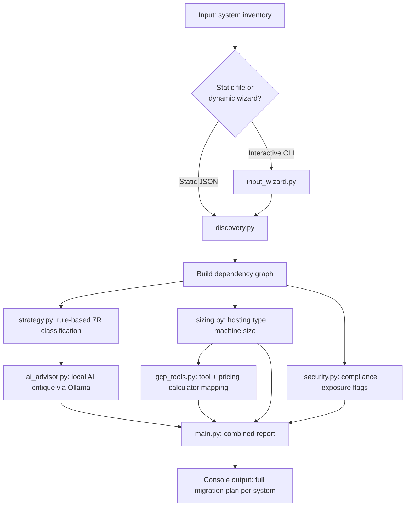

# Enterprise Migration Solution

An AI-assisted tool that analyzes an organization's application inventory and
generates a per-system cloud migration plan for Google Cloud Platform (GCP) —
combining rule-based decision logic with local AI reasoning.

Built after a presales interview that required documentation and solution
design work under time pressure. This project automates the repeatable parts
of that process: dependency assessment, migration strategy (7Rs), hosting
recommendations, machine sizing, security considerations, and mapping each
recommendation to the actual GCP tool and pricing calculator needed next.

**Status:** Working prototype. GCP-only. Built for learning and demonstration,
not production scale.

---

## What it does

Given a list of an organization's applications/systems (their dependencies,
operating system, CPU/memory needs, compliance requirements, and workload
type), the tool produces, for each system:

1. **Dependency graph** — what depends on what
2. **7R classification** — Rehost, Replatform, Refactor, Repurchase, Retire,
   Retain, or Relocate, with a rule-based reason
3. **AI-generated critique** — a local AI model (via Ollama) reviews and
   challenges the rule-based recommendation
4. **Hosting recommendation** — VM, Kubernetes (GKE), or SaaS
5. **Machine sizing** — a starting CPU/memory tier to look up on a pricing
   calculator
6. **Security flags** — internet exposure, compliance requirements (e.g.
   PCI-DSS), EOL operating systems
7. **GCP migration tool + process** — the specific tool to use (e.g. Migrate
   to Virtual Machines, Migrate to Containers) and the pricing calculator link

---

## Architecture / flow



---

## Setup

1. Install Python 3.11+ and [Ollama](https://ollama.com/download)
2. Pull the local model:
   ```powershell
   ollama pull llama3.2
   ```
3. Clone this repo and set up a virtual environment:
   ```powershell
   python -m venv venv
   venv\Scripts\activate
   pip install -r requirements.txt
   ```

> **Windows note:** if `venv\Scripts\activate` is blocked by PowerShell's
> execution policy, run:
> ```powershell
> Set-ExecutionPolicy -ExecutionPolicy RemoteSigned -Scope CurrentUser
> ```

Make sure Ollama is running in the background (check for its icon in the
system tray) before running the pipeline.

---

## Usage

**Static input** — edit or create a JSON file describing your systems (see
`data/sample_input.json` and `data/complex_input.json` for examples), then:

```powershell
python src/main.py --input data/complex_input.json
```

**Dynamic input** — build the inventory interactively instead of hand-editing
JSON:

```powershell
python src/input_wizard.py
python src/main.py --input data/dynamic_input.json
```

---

## Sample output

```
--- api-gateway ---
  7R decision (rule-based): rehost
  Reason: Has dependencies or moderate criticality — move as-is first, revisit later.
  AI assessment: I would challenge "rehost" here — api-gateway is internet-facing
  and PCI-DSS scoped, which makes Replatform a stronger candidate so it can pick
  up managed load balancing and WAF capabilities natively...
  Recommended hosting: Kubernetes — Stateless workload on a supported OS — good containerization candidate.
  OS status: Ubuntu 22.04 is currently supported.
  Suggested machine size: Medium (4 vCPU / 16GB) — e.g., GCP n2-standard-4
  Security flags:
    - Internet-facing: requires Cloud Armor (WAF) and a Load Balancer with TLS.
    - PCI-DSS compliance: requires CMEK and audit logging via Cloud Audit Logs.
  GCP migration tool: Migrate to Containers (part of Google Cloud Migration Center)
  Pricing calculator: https://cloud.google.com/products/calculator
  Migration steps:
    1. Containerize the app (Docker) if not already.
    2. Use 'Migrate to Containers' to auto-generate a K8s deployment from a VM image.
    3. Deploy to GKE Autopilot (simplest) or GKE Standard (more control).
    4. Set up Cloud Load Balancing + Cloud Armor if internet-facing.
```


---

## Roadmap / open for collaboration

This is a working prototype, not a finished product. Areas that would need
real work to take this to enterprise scale:

- Multi-cloud support (AWS, Azure) instead of GCP-only
- Live cloud inventory scanning instead of manual/JSON input
- Real-time pricing API integration instead of static tool mapping
- Proper UI instead of CLI output

If you're interested in collaborating on any of the above, feel free to reach
out.

---

## License

Copyright © 2026 Anushka Mestry. All rights reserved.

This repository is public for viewing and demonstration purposes only. No
permission is granted to use, copy, modify, or distribute this code without
explicit written permission from the author.
